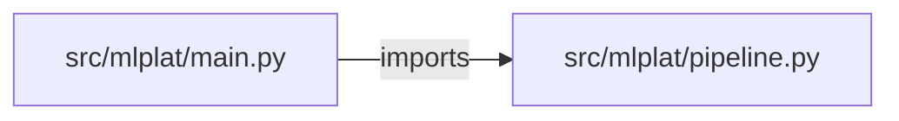

# production-ml-platform — project architecture

[README](README.md) · [Interview questions and answers](INTERVIEW_QA.md)

## Purpose and scope

Data → validate → train → registry → deploy check → monitor → drift → retrain recommendation. Kubernetes apply stays false.

This document describes files and symbols in this checkout. Deployment templates and statements in the original overview are distinguished from a verified running environment.

## Component diagram



For Python repositories, arrows show resolved local imports, not network calls or deployment order. Otherwise the diagram is a repository component map; containment arrows do not assert runtime integration.

## Components and responsibilities

| Component | Responsibility |
| --- | --- |
| [`src/mlplat/main.py`](src/mlplat/main.py) | HTTP handlers: `GET /healthz`, `POST /validate`, `POST /register`, `POST /promote`, `POST /drift` |
| [`src/mlplat/pipeline.py`](src/mlplat/pipeline.py) | Functions: `validate`, `register`, `promote`, `drift`, `deploy_check` |
| [`requirements.txt`](requirements.txt) | Implementation or supporting configuration |
| [`tests/test_mlplat.py`](tests/test_mlplat.py) | Executable checks and regression examples |
| [`.github/workflows/ci.yml`](.github/workflows/ci.yml) | GitHub Actions job definitions |
| [`README.md`](README.md) | Project explanations or operating notes |

## Request interface

| Method and path | Handler | Source |
| --- | --- | --- |
| `GET /healthz` | `healthz` | [`src/mlplat/main.py`](src/mlplat/main.py#L6) |
| `POST /validate` | `post_validate` | [`src/mlplat/main.py`](src/mlplat/main.py#L10) |
| `POST /register` | `post_register` | [`src/mlplat/main.py`](src/mlplat/main.py#L17) |
| `POST /promote` | `post_promote` | [`src/mlplat/main.py`](src/mlplat/main.py#L21) |
| `POST /drift` | `post_drift` | [`src/mlplat/main.py`](src/mlplat/main.py#L28) |
| `POST /deploy/check` | `post_deploy` | [`src/mlplat/main.py`](src/mlplat/main.py#L32) |

The table lists literal route decorators found in the inspected Python modules. Router prefixes and middleware can add behavior; check the linked handler and application setup before calling an endpoint.

## Implementation walkthrough

### `validate(rows)`

Source: [`src/mlplat/pipeline.py`](src/mlplat/pipeline.py#L4).

Calls visible in this function: `ValueError`, `any`, `isinstance`, `len`.

```python
def validate(rows):
    if not isinstance(rows, list) or len(rows) < 8:
        raise ValueError("need at least 8 rows")
    if any("label" not in row for row in rows):
        raise ValueError("label required")
    return {"ok": True, "rows": len(rows)}
```

### `promote(name)`

Source: [`src/mlplat/pipeline.py`](src/mlplat/pipeline.py#L15).

Calls visible in this function: `ValueError`.

```python
def promote(name):
    if name not in REGISTRY:
        raise ValueError("unknown model")
    REGISTRY["champion"] = REGISTRY[name]
    return {"champion": name, "applied": False}
```

### `deploy_check(image)`

Source: [`src/mlplat/pipeline.py`](src/mlplat/pipeline.py#L25).

Calls visible in this function: `failed.append`, `str`, `str(image).endswith`.

```python
def deploy_check(image):
    failed = []
    if str(image).endswith(":latest") or image == "latest":
        failed.append("latest")
    return {"passed": not failed, "failed": failed, "applied": False}
```

### `register(name, metrics)`

Source: [`src/mlplat/pipeline.py`](src/mlplat/pipeline.py#L11).

Calls visible in this function: `len`, `str`.

```python
def register(name, metrics):
    REGISTRY[name] = {"version": str(len(REGISTRY)+1), "metrics": metrics or {}}
    return REGISTRY[name]
```

## Validation and failure paths

| Explicit exception | Source |
| --- | --- |
| `HTTPException(422, str(exc))` | [`src/mlplat/main.py`](src/mlplat/main.py#L14) |
| `HTTPException(422, str(exc))` | [`src/mlplat/main.py`](src/mlplat/main.py#L25) |
| `ValueError('need at least 8 rows')` | [`src/mlplat/pipeline.py`](src/mlplat/pipeline.py#L6) |
| `ValueError('label required')` | [`src/mlplat/pipeline.py`](src/mlplat/pipeline.py#L8) |
| `ValueError('unknown model')` | [`src/mlplat/pipeline.py`](src/mlplat/pipeline.py#L17) |

These are explicit exceptions in the inspected source, rather than a claim that every failure is handled. Follow the calling handler to see whether the exception becomes an HTTP response or propagates.

## Data and state

- [`src/mlplat/pipeline.py`](src/mlplat/pipeline.py) defines module-level containers: `REGISTRY`.

Module-level dictionaries/lists live in a Python process. They can be fixtures or mutable state; inspect writes before treating them as persistent storage. A production extension would need to define persistence and concurrency behavior explicitly.

## Data flow and design decisions

### What is the input-to-output contract of `validate`

In [`src/mlplat/pipeline.py`](src/mlplat/pipeline.py#L4), `validate(rows)` receives the inputs. The function computes these intermediate values:

The implementation delegates or iterates directly; trace the calls in the source walkthrough.

Its result is defined by:

- `{'ok': True, 'rows': len(rows)}`

### Which decision rules or boundary conditions should an interviewer challenge

The implementation in [`src/mlplat/pipeline.py`](src/mlplat/pipeline.py#L4) branches on:

- `not isinstance(rows, list) or len(rows) < 8`
- `any(('label' not in row for row in rows))`

A useful extension is a table-driven test that covers each condition just below, at, and above its boundary where applicable. These expressions are the current rules; changing them changes behavior and should be justified by the project’s acceptance criteria.

## Setup and verification

The following commands are derived from the checked-in dependency/test contracts. Execute them from the repository root; the block prepares a local environment, not a cloud deployment.

```bash
python3 -m venv .venv
source .venv/bin/activate
python -m pip install -r requirements.txt
python -m pytest -q
```

Python dependencies: [`requirements.txt`](requirements.txt).

Test entry points: [`tests/test_mlplat.py`](tests/test_mlplat.py).

Automation definitions: [`.github/workflows/ci.yml`](.github/workflows/ci.yml). Read their triggers and job steps to determine what CI actually runs.

## Operating boundaries and design review

Before turning this checkout into a customer deployment, establish the input contract, data ownership, access controls, failure response, evaluation criteria, and rollback owner. Repository fixtures and unit tests demonstrate local behavior; they do not establish throughput, uptime, compliance, or business impact.

A useful architecture review starts with the linked implementation: identify where input enters, where a decision is made, which state can change, and which external dependency can fail. Add a deployment view only for infrastructure that is actually configured and exercised.
